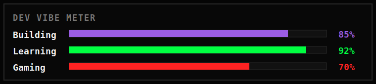

<div align="center">

<table>
  <tr>
    <td>
      <sub>
        🔴 🟡 🟢
        &nbsp;&nbsp;README.md &mdash; cacaguadios/cacaguadios&nbsp;&nbsp;
        <code>ONLINE</code>
      </sub>
    </td>
  </tr>
</table>

<br />

<a href="https://github.com/Cacaguadios">
  
</a>
<a href="https://github.com/Cacaguadios">
  
</a>
<a href="mailto:mp3208910@gmail.com">
  
</a>

<br /><br />


<br /><br />


</div>

```txt
$ cat README.md
▌
WHAT'S UP, I'M MAURICIO 👋
aka Cacaguadios

Software Developer Jr from México.
I build web apps, PWAs, APIs and creative projects.
```

<div align="center">

`💻 // coding...` · `📍 México 🇲🇽` · `🕹️ Junior Dev` · `☕ caffeinated`

</div>

---

## `> PLAYER_CARD`

```txt
┌──────────────────────────────────────────────┐
│  PLAYER      Mauricio Popoca                 │
│  AKA         Cacaguadios                     │
│  CLASS       Software Developer Jr           │
│  REGION      México                          │
│  MODE        Build · Learn · Ship · Repeat   │
└──────────────────────────────────────────────┘
```

<div align="center">


</div>

---

## `> ABOUT_ME`

```txt
// profile.log 🧠
Soy desarrollador Full Stack Jr. Me gusta construir interfaces limpias,
conectar frontend con backend, trabajar con bases de datos y automatizar
procesos que ahorran tiempo real.

Actualmente estoy reforzando arquitectura, .NET, APIs limpias, cloud y
mejores prácticas para construir productos más sólidos.
```

```json
{
  "focus": ["web apps", "APIs", "PWAs", "automation", "creative projects"],
  "interests": ["web dev", "pixel art", "gaming", "skateboarding", "music"],
  "coffeePerDay": "████░",
  "status": "leveling up"
}
```

---

## `> TECH_STACK`

<div align="center">
  
</div>

```txt
🧩 BACKEND     -> .NET, C#, NestJS, PHP MVC, REST APIs
🎨 FRONTEND    -> Angular, Vue, TypeScript, JavaScript, HTML, CSS
🗄️ DATABASE    -> MySQL
☁️ CLOUD       -> Azure
⚙️ AUTOMATION  -> Power Apps, Power Automate, Power BI
🛠️ TOOLS       -> Git, GitHub, VS Code, Visual Studio, Postman
```

---

## `> QUEST_LOG`

```txt
🟢 [ACTIVE BUILD]    ComponentsCore
MISSION           E-commerce de componentes de PC con autenticación JWT,
                  catálogo, usuarios y flujo de compra.
STACK             Angular · NestJS · MySQL · JWT

✅ [COMPLETED]       AppEgresados
MISSION           Plataforma de seguimiento de egresados y bolsa de trabajo
                  para gestión de información.
STACK             PHP MVC · MySQL

🟡 [LEVELING UP]     MathMass
MISSION           PWA educativa para reforzar matemáticas en primaria con una
                  experiencia interactiva.
STACK             Vue · TypeScript · PWA

🟣 [ON DEMAND]       Automatizaciones
MISSION           Flujos, aplicaciones y dashboards para optimizar procesos
                  y reportes.
STACK             Power Platform
```

---

## `> SIDE_QUESTS`

```txt
[+] 🧱 Build better backend architecture with .NET and clean APIs
[+] 🖼️ Create modern interfaces with Angular and Vue
[+] ⚡ Automate repetitive work with Power Platform
[+] ☁️ Keep learning cloud workflows with Azure
[+] 🎧 Stay creative through pixel art, skate, videogames and music
```

---

## `> CONTACT`

<div align="center">
  <a href="https://github.com/Cacaguadios">
    
  </a>
  <a href="mailto:mp3208910@gmail.com">
    
  </a>
  <a href="https://www.linkedin.com/">
    
  </a>
</div>

<div align="center">
  
</div>

---

## `> GITHUB_STATS`

<div align="center">
  
  <br />
  
  <br /><br />
  <picture data-importer="pacman">
    <source media="(prefers-color-scheme: dark)" srcset="https://raw.githubusercontent.com/cacaguadios/cacaguadios/pacman-output/pacman-contribution-graph-dark.svg?game=pacman">
    <source media="(prefers-color-scheme: light)" srcset="https://raw.githubusercontent.com/cacaguadios/cacaguadios/pacman-output/pacman-contribution-graph.svg?game=pacman">
    
  </picture>
</div>

```txt
SYSTEM MESSAGE:
Thanks for visiting my profile.
New quests, better code and stronger builds are loading...
```
