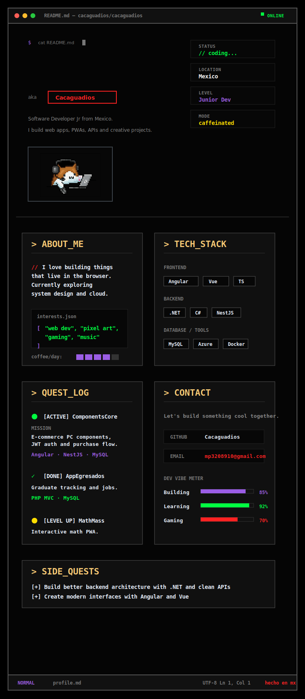

  

 

  
   
  
    
  <picture data-importer="pacman">
    <source media="(prefers-color-scheme: dark)" srcset="https://raw.githubusercontent.com/cacaguadios/cacaguadios/pacman-output/pacman-contribution-graph-dark.svg?game=pacman">
    <source media="(prefers-color-scheme: light)" srcset="https://raw.githubusercontent.com/cacaguadios/cacaguadios/pacman-output/pacman-contribution-graph.svg?game=pacman">
    
  </picture>

