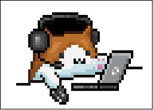

<div align="center">

<sub>README.md &mdash; cacaguadios/cacaguadios</sub>

<br />

<a href="https://github.com/Cacaguadios">
  
</a>
<a href="https://github.com/Cacaguadios">
  
</a>
<a href="mailto:mp3208910@gmail.com">
  
</a>

<br /><br />



<h1>WHAT'S UP, I'M MAURICIO 👋</h1>

<p>
  <strong>aka <span>Cacaguadios</span></strong><br />
  Software Developer Jr from México.<br />
  I build web apps, PWAs, APIs and creative projects.
</p>

<p>
  <code>// coding...</code> · <code>México 🇲🇽</code> · <code>Junior Dev</code> · <code>caffeinated</code>
</p>

</div>

---

### `> ABOUT ME_`

```txt
Soy desarrollador Full Stack Jr.
Me gusta construir interfaces limpias, conectar frontend con backend,
trabajar con bases de datos y automatizar procesos que ahorran tiempo real.
```

```json
{
  "interests": [
    "web dev",
    "pixel art",
    "gaming",
    "skateboarding",
    "music"
  ],
  "coffeePerDay": "████░"
}
```

### `> TECH STACK_`

<div align="center">
  
</div>

| Area | Tools |
| --- | --- |
| Backend | `.NET` · `C#` · `NestJS` · `PHP MVC` · `REST APIs` |
| Frontend | `Angular` · `Vue` · `TypeScript` · `JavaScript` · `HTML` · `CSS` |
| Database | `MySQL` |
| Cloud | `Azure` |
| Automation | `Power Apps` · `Power Automate` · `Power BI` |
| Tools | `Git` · `GitHub` · `VS Code` · `Visual Studio` · `Postman` |

### `> FEATURED PROJECTS_`

| Project | Mission | Stack | Status |
| --- | --- | --- | --- |
| **ComponentsCore** | E-commerce de componentes de PC con autenticación JWT, catálogo, usuarios y flujo de compra. | `Angular` · `NestJS` · `MySQL` · `JWT` | `Active build` |
| **AppEgresados** | Plataforma de seguimiento de egresados y bolsa de trabajo para gestión de información. | `PHP MVC` · `MySQL` | `Completed quest` |
| **MathMass** | PWA educativa para reforzar matemáticas en primaria con una experiencia interactiva. | `Vue` · `TypeScript` · `PWA` | `Leveling up` |
| **Automatizaciones** | Flujos, aplicaciones y dashboards para optimizar procesos y reportes. | `Power Platform` | `On demand` |

### `> CONTACT_`

<div align="center">
  <a href="https://github.com/Cacaguadios">
    
  </a>
  <a href="mailto:mp3208910@gmail.com">
    
  </a>
  <a href="https://www.linkedin.com/">
    
  </a>
</div>

```txt
DEV VIBE METER
Building  ████████░░ 85%
Learning  █████████░ 92%
Gaming    ███████░░░ 70%
```

### `> GITHUB_STATS_`

<div align="center">
  
  <br />
  
  <br /><br />
  <picture data-importer="pacman">
    <source media="(prefers-color-scheme: dark)" srcset="https://raw.githubusercontent.com/cacaguadios/cacaguadios/pacman-output/pacman-contribution-graph-dark.svg?game=pacman">
    <source media="(prefers-color-scheme: light)" srcset="https://raw.githubusercontent.com/cacaguadios/cacaguadios/pacman-output/pacman-contribution-graph.svg?game=pacman">
    
  </picture>
</div>

```txt
SYSTEM MESSAGE:
Thanks for visiting my profile.
New quests, better code and stronger builds are loading...
```
